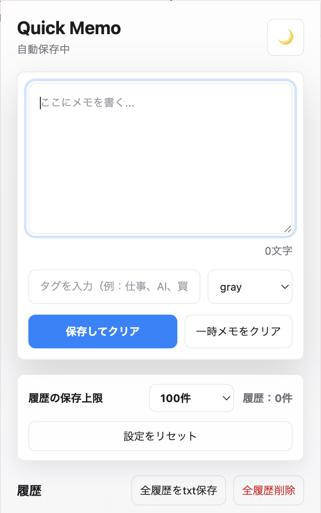
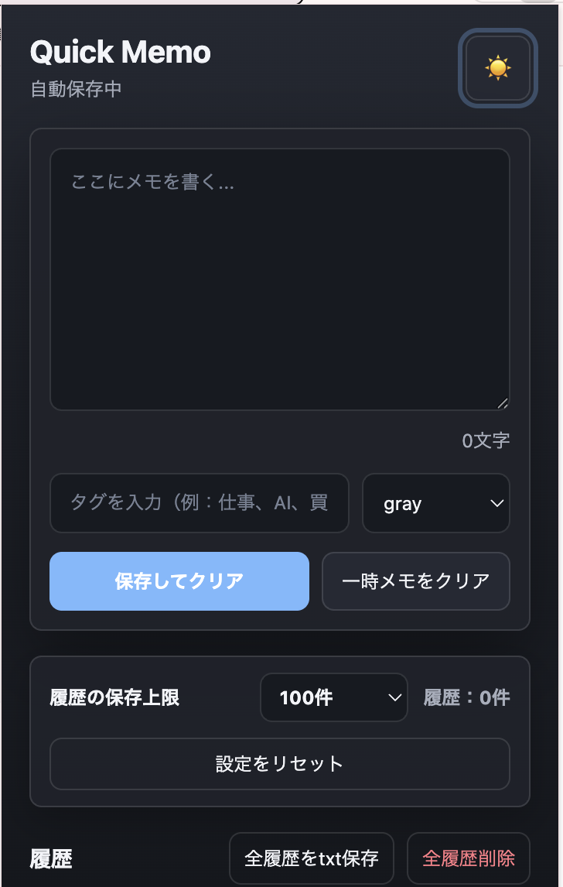
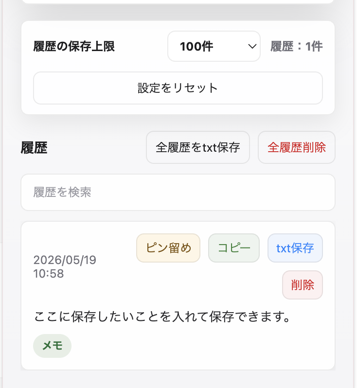

# Quick Memo Lite

Quick Memo Liteは、Brave / Chromeで使える軽量メモ拡張機能です。

ツールバーからすぐにメモを開けるため、作業中のアイデア、調べもの、買い物メモ、学習メモなどを素早く残せます。履歴保存・検索・コピー・タグ管理・txt保存・ピン留め・ダークモード・自動整理に対応しており、シンプルながら日常的に使いやすいメモ環境を目指しています。

## 制作背景

日常的にブラウザで作業する中で、ちょっとしたメモを取りたい時に別アプリを立ち上げるのが手間に感じていました。

そこで、ブラウザ上で素早くメモを残せて、必要な情報をあとから検索・整理できる軽量な拡張機能として制作しました。

履歴保存、検索、タグ管理、ピン留め、txt保存、自動整理など、実際の使用シーンを想定して機能を追加しています。

## スクリーンショット

### ライトモード

### ダークモード

### 検索・タグ・ピン留め

## 主な機能

- 即メモ
- 自動保存
- 履歴保存
- 履歴検索
- コピー
- txt保存
- ピン留め
- タグ管理
- タグ色選択
- ダークモード
- 文字数カウント
- 履歴保存上限設定
- 設定リセット

## 使用技術

- HTML
- CSS
- JavaScript
- Chrome Extension Manifest V3
- chrome.storage.local

## インストール方法

1. このリポジトリをダウンロードします。
2. BraveまたはChromeで拡張機能ページを開きます。
3. デベロッパーモードをONにします。
4. 「パッケージ化されていない拡張機能を読み込む」をクリックします。
5. このフォルダを選択します。

## 使い方

拡張機能を読み込んだ後、ブラウザのツールバーからQuick Memo Liteを開きます。メモ入力欄に内容を入力すると自動保存され、「保存してクリア」を押すと履歴として保存されます。

保存した履歴は検索、コピー、txt保存、削除ができます。重要な履歴はピン留めでき、タグを付けることであとから絞り込みやすくなります。タグには色を設定できるため、用途ごとに視覚的に整理できます。

## 今後の改善案

- Markdown対応
- CSVエクスポート
- ショートカットキー対応
- UI改善

## 補足

メモや設定はブラウザの`chrome.storage.local`に保存されます。外部サーバーへデータを送信しない、ローカル完結型の軽量なメモ拡張です。
